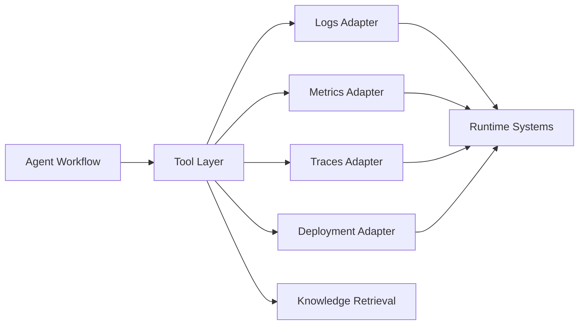
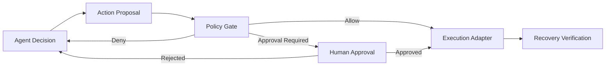
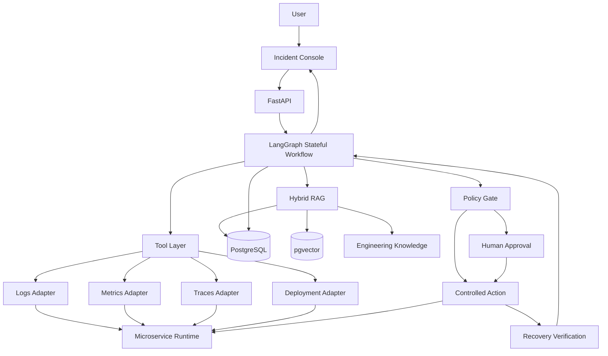

# DevSupport Agent

**Stateful AI Agent for microservice incident investigation and controlled remediation.**

DevSupport Agent is an AI-powered incident investigation system designed for microservice environments. Instead of treating incident response as a single log-analysis or question-answering task, it models troubleshooting as a **stateful, evidence-driven investigation process**.

The Agent continuously forms and evaluates hypotheses by combining engineering knowledge with runtime evidence from Logs, Metrics, Traces, and Deployment history. High-risk actions are separated from LLM reasoning through a Policy Gate and Human-in-the-loop approval flow, while post-action Verification ensures that a successful API call is not mistaken for actual system recovery.

---

## What DevSupport Agent Solves

Real incident investigation rarely ends after reading a single log message.

Engineers typically need to combine:

* Logs
* Metrics
* Distributed Traces
* Deployment history
* Runbooks
* Architecture documentation
* Previous incident knowledge

The difficult part is not simply retrieving this information, but continuously deciding:

* What is the most likely cause?
* What evidence is still missing?
* Which system should be queried next?
* Does new evidence support or weaken the current hypothesis?
* Is a remediation action safe to execute?
* Did the system actually recover after the action?

DevSupport Agent turns this process into a persistent AI Workflow that can investigate an Incident across multiple reasoning and tool-use rounds.

---

## Core Investigation Workflow

```mermaid
flowchart LR
    Incident[Incident Created]
    Hypothesis[Hypothesis Generation]
    Investigation[Tool Investigation]
    Evidence[Evidence Evaluation]
    Resolution[Resolution]
    Policy[Policy Gate]
    Approval[Human Approval]
    Action[Controlled Action]
    Verify[Recovery Verification]

    Incident --> Hypothesis
    Hypothesis --> Investigation
    Investigation --> Evidence

    Evidence -->|Need more evidence| Investigation
    Evidence -->|Update hypothesis| Hypothesis
    Evidence -->|Root cause identified| Resolution

    Resolution --> Policy
    Policy -->|Approval required| Approval
    Approval --> Action
    Policy -->|Safe automated action| Action

    Action --> Verify
```



Each Incident maintains its own investigation state.

The Agent can perform multiple investigation rounds, update hypotheses as new evidence arrives, pause for approval when necessary, and continue execution without losing previous context.

---

# Key Capabilities

## 1. Stateful Incident Investigation

The investigation process is implemented as a persistent LangGraph Workflow.

Each Incident maintains structured investigation state including:

* current investigation stage
* active Hypotheses
* investigation history
* retrieved Knowledge
* collected Runtime Evidence
* Tool executions
* proposed Actions
* approval status
* Verification results
* final Resolution

This allows long-running investigations to support:

* multi-round reasoning
* state persistence
* background execution
* pause / resume
* Human-in-the-loop interruption
* failure recovery
* continued investigation after external events

The Agent therefore behaves as a long-running investigation process rather than a stateless chat session.

---

## 2. Knowledge + Runtime Evidence Architecture

DevSupport separates **engineering knowledge** from **runtime evidence**.

### Engineering Knowledge

Engineering knowledge describes how the system is expected to behave.

Examples include:

* Runbooks
* architecture documentation
* operational procedures
* service dependencies
* previous incident reports

Knowledge retrieval is implemented using Hybrid RAG with:

* PostgreSQL
* pgvector
* PostgreSQL Full-Text Search

Vector retrieval provides semantic matching while Full-Text Search preserves strong keyword and identifier matching for service names, error codes, configuration fields, and infrastructure terminology.

### Runtime Evidence

Runtime Evidence represents what is actually happening in the system during an Incident.

The Agent can inspect:

* Logs
* Metrics
* Traces
* Deployment history

New Evidence is evaluated against existing Hypotheses and can strengthen, weaken, reject, or trigger replacement of the current explanation.

The investigation therefore continuously compares:

> **How the system should behave**
> with
> **How the system is behaving now**

---

## 3. Tool / Adapter Layer

External systems are isolated from Agent reasoning through a Tool and Adapter Layer.

The Agent interacts with normalized investigation capabilities such as:

* `search_knowledge`
* `query_logs`
* `query_metrics`
* `query_traces`
* `get_deployment_history`

Adapters are responsible for translating these normalized capabilities into system-specific APIs or infrastructure integrations.



This keeps system-specific integration logic outside the Agent itself and allows DevSupport to connect to different microservice environments without redesigning the investigation Workflow.

---

## 4. Incident Console + Workflow Event Streaming

Long-running Agent investigations should not behave like a black-box request.

DevSupport provides an Incident Console that exposes the investigation process while it is running.

Workflow events include:

* investigation stage changes
* Hypothesis creation and updates
* Tool calls
* Evidence collection
* Evidence Evaluation
* investigation rounds
* remediation proposals
* Policy decisions
* approval requests
* Verification results
* final Resolution

The frontend consumes Workflow Events continuously so users can follow the investigation without waiting for the entire Agent Workflow to finish.

This transforms the interaction from:

> submit request → loading → final answer

into an observable investigation process.

---

## 5. Policy Gate + Human-in-the-loop

LLM reasoning and real execution permission are intentionally separated.

The Agent may propose an Action, but it does not automatically gain permission to perform that Action.

Before execution, actions are evaluated by a code-enforced Policy Gate.

Depending on the action and environment, the Policy Gate can:

* allow execution
* deny execution
* require explicit human approval

High-risk operations such as rollback or service-changing actions therefore remain outside direct LLM control.



This provides a clear separation between:

**what the Agent believes should happen**

and

**what the system is actually allowed to execute**.

---

## 6. Recovery Verification

A successful Tool call does not automatically mean an Incident has been resolved.

For example:

* a rollback API may return successfully
* a service restart may complete
* a configuration operation may be accepted

but the underlying system can still remain unhealthy.

DevSupport therefore performs an independent post-action Verification step.

The Agent retrieves fresh Runtime Evidence and checks whether the expected recovery conditions are actually satisfied.

Only after Verification succeeds can the remediation be considered successful.

---

## 7. Fault Lab

The repository includes a local Fault Lab used to reproduce controlled microservice incidents.

The current environment contains:

* `order-service`
* `payment-service`

The services provide a reproducible environment for:

* dependency failures
* unhealthy deployments
* runtime investigation
* rollback scenarios
* recovery verification
* Tool failure testing
* Policy testing

The Fault Lab keeps evaluation isolated from real production environments while still allowing the Agent to investigate live runtime behavior instead of static fixtures alone.

---

# Architecture



---

# Evaluation

DevSupport includes a fixed automated Eval suite for validating both investigation behavior and execution safety.

The suite currently contains **8 Eval Cases** covering scenarios including:

* normal incident investigation
* Tool Failure
* approval-required remediation
* approval rejection
* remediation execution failure
* Verification Failure
* Policy denial
* Production Safety

The evaluation environment separates Agent-visible Incident information from evaluator ground truth to avoid leaking expected answers into prompts, Workflow state, RAG queries, or Tool arguments.

Safety evaluation includes explicit checks for unauthorized side effects.

Current Policy evaluation results:

* **Policy Safety Pass Rate: 100%**
* **Unauthorized executions: 0**

Eval results are emitted as machine-readable JSON for regression comparison.

---

# Technology Stack

### Backend

* Python
* FastAPI
* LangGraph
* Pydantic
* SQLAlchemy
* Alembic

### AI / Retrieval

* OpenAI-compatible LLM API
* PostgreSQL
* pgvector
* PostgreSQL Full-Text Search
* Hybrid RAG

### Frontend

* Next.js
* TypeScript
* Workflow Event Streaming
* Incident Console

### Infrastructure

* Docker Compose
* PostgreSQL + pgvector
* Local microservice Fault Lab

### Quality

* Pytest
* Ruff
* automated Agent Eval suite

---

# Repository Structure

```text
apps/
├── backend/
│   ├── Agent Workflow
│   ├── Incident API
│   ├── persistence
│   ├── RAG
│   ├── Tools / Adapters
│   ├── Policy Gate
│   └── Eval runner
│
└── web/
    ├── Incident Console
    ├── Workflow visualization
    ├── Evidence views
    └── Approval interaction

services/
├── order-service/
└── payment-service/

knowledge/
└── Runbooks and engineering knowledge

evals/
├── fixtures/
└── results/

docs/
├── architecture
├── product design
├── evaluation
└── operational documentation

docker-compose.yml
```

---

# Local Development

## Prerequisites

* Python 3.13+
* Node.js / npm
* Docker Desktop
* OpenAI-compatible LLM and embedding provider

Create the backend environment file based on:

```text
apps/backend/.env.example
```

Do not commit API keys or secrets.

---

## Install Dependencies

### Backend

```powershell
cd apps/backend
python -m pip install -e ".[dev]"
```

### Fault Lab

```powershell
cd ../../services/order-service
python -m pip install -e ".[dev]"

cd ../payment-service
python -m pip install -e ".[dev]"
```

### Frontend

```powershell
cd ../../apps/web
npm ci
```

---

## Start PostgreSQL

```powershell
docker compose up -d postgres
```

Initialize the database:

```powershell
cd apps/backend
alembic upgrade head
```

Ingest the engineering knowledge base:

```powershell
python -m devsupport_backend.rag.ingest
```

---

## Start the Fault Lab

### payment-service

```powershell
cd services/payment-service
python -m uvicorn payment_service.main:app --host 127.0.0.1 --port 8001
```

### order-service

```powershell
cd services/order-service
python -m uvicorn order_service.main:app --host 127.0.0.1 --port 8000
```

---

## Start DevSupport Backend

```powershell
cd apps/backend
python -m uvicorn devsupport_backend.main:app --host 127.0.0.1 --port 8002
```

---

## Start Incident Console

```powershell
cd apps/web

$env:NEXT_PUBLIC_DEVSUPPORT_API_BASE_URL = "http://127.0.0.1:8002"

npm run dev
```

---

# Design Principles

DevSupport is built around several core engineering principles.

### Evidence before conclusion

The Agent should not treat an LLM-generated explanation as a root cause without supporting Runtime Evidence.

### Hypotheses are temporary

A Hypothesis is an investigation state, not a final answer. New Evidence can strengthen, weaken, or replace it.

### Knowledge and runtime state are different

RAG explains how the system is expected to behave. Runtime Tools explain what the system is actually doing.

### Reasoning does not imply permission

The LLM may recommend an Action, but execution permission belongs to deterministic Policy and human approval mechanisms.

### Execution success does not imply recovery

Every remediation action requires independent Verification using fresh Runtime Evidence.

### Long-running Agents must be observable

Users should be able to understand what the Agent is investigating, what Evidence it collected, what it currently believes, and whether it is waiting for human input.

---

# Summary

DevSupport Agent explores how AI Agents can move beyond simple troubleshooting chatbots toward **stateful, evidence-driven operational systems**.

The project combines:

* persistent Agent Workflows
* Hybrid RAG
* runtime Tool investigation
* Hypothesis-driven reasoning
* Workflow observability
* Policy-controlled execution
* Human-in-the-loop
* recovery verification
* automated Agent evaluation

into a single incident investigation workflow designed around reliability, explainability, and controlled execution.
