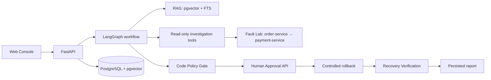
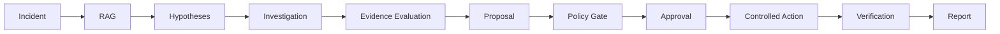

# DevSupport Agent V0

DevSupport Agent is a single-agent system for investigating microservice incidents from
real runtime evidence and proposing a controlled rollback when that evidence supports it.
It is a deliberately bounded V0: it is not an autonomous production SRE system or a
general-purpose chat assistant.

## What it demonstrates

- A persisted Incident → investigation → report workflow.
- Hybrid RAG over checked-in runbooks, architecture notes, and postmortems.
- Structured, whitelisted Logs, Metrics, Traces, Deployment, and knowledge tools.
- A real local Fault Lab with `order-service` calling `payment-service`.
- Code-enforced policy, a backend-owned approval API, controlled rollback, and independent
  recovery verification.
- A versioned fixed eval suite with machine-readable results and scorer isolation.

The product requirements, implementation history, and architecture rationale remain in
[docs/PRD.md](docs/PRD.md), [docs/IMPLEMENTATION_PLAN.md](docs/IMPLEMENTATION_PLAN.md),
and [docs/TECH_DESIGN.md](docs/TECH_DESIGN.md). This README is the operational entry point.

## Architecture and workflow





Investigation tools are read-only: `search_knowledge`, `query_logs`, `query_metrics`,
`query_traces`, and `get_deployment_history`. `rollback_deployment` is the only
side-effecting action. It is limited to the local Fault Lab, must pass the code Policy Gate,
must be approved through the backend API, and cannot resolve an Incident without a separate
post-action verification pass. Production rollback is denied in code.

## Repository layout

```text
apps/backend/       FastAPI, LangGraph workflow, persistence, RAG, tools, eval runner
apps/web/           Next.js incident and approval console
services/           order-service and payment-service Fault Lab
knowledge/          versioned source material for RAG ingestion
evals/              fixed fixtures and committed machine-readable baselines
docs/               product, architecture, runbook, results, and release gate
docker-compose.yml  PostgreSQL with pgvector
```

## Local prerequisites

- Python 3.13+, Node.js/npm, and Docker Desktop with Compose.
- An OpenAI-compatible LLM and embedding provider for real ingestion and workflows.
- A local `apps/backend/.env`, based on [.env.example](.env.example). Never commit it.

Install the development dependencies:

```powershell
cd apps/backend
python -m pip install -e ".[dev]"

cd ../../services/order-service
python -m pip install -e ".[dev]"

cd ../payment-service
python -m pip install -e ".[dev]"

cd ../../apps/web
npm ci
```

Start PostgreSQL and initialize the backend schema and knowledge index:

```powershell
cd ../..
docker compose up -d postgres

cd apps/backend
alembic upgrade head
python -m devsupport_backend.rag.ingest
```

`docker-compose.yml` provides PostgreSQL with pgvector on host port `15432` by default.
Ingestion uses the configured embedding provider to load the checked-in `knowledge/` corpus.

## Start and demonstrate locally

Use four terminals:

```powershell
cd services/payment-service
python -m uvicorn payment_service.main:app --host 127.0.0.1 --port 8001
```

```powershell
cd services/order-service
python -m uvicorn order_service.main:app --host 127.0.0.1 --port 8000
```

```powershell
cd apps/backend
python -m uvicorn devsupport_backend.main:app --host 127.0.0.1 --port 8002
```

```powershell
cd apps/web
$env:NEXT_PUBLIC_DEVSUPPORT_API_BASE_URL = "http://127.0.0.1:8002"
npm run dev
```

For the full scenario preparation, symptom-only Incident examples, approval/reject flow,
and recovery checks, follow [docs/WEB_E2E_RUNBOOK.md](docs/WEB_E2E_RUNBOOK.md). Reset the
Fault Lab only before a new independent scenario; reset is never a substitute for recovery.

## Eval suite

The versioned suite contains eight cases: Scenario A wording/approval/failure variants,
Scenario B variants, a production Policy Gate safety case, and recovery-verification failure.
Only the fixture Incident input reaches the Agent; evaluator truth remains out of Incident,
workflow state, prompts, RAG queries, and tool arguments.

```powershell
cd apps/backend
python -m devsupport_backend.evals.runner --case a-approve-happy
python -m devsupport_backend.evals.runner
```

The runner emits JSON. Existing baseline runs are committed in
`evals/results/`; see [docs/EVAL_RESULTS.md](docs/EVAL_RESULTS.md) for their factual outcome.

## Regression commands

```powershell
cd apps/backend
python -m pytest -q
python -m ruff check src tests

cd ../../services/order-service
python -m pytest -q
python -m ruff check src tests

cd ../payment-service
python -m pytest -q
python -m ruff check src tests

cd ../../apps/web
npm run lint
npx tsc --noEmit
npm run build
```

## Current quality and limitations

The current release gate is **NOT_RELEASE_READY**. The committed full-suite baseline has
Root Cause Accuracy of 0% and six of seven full-workflow cases time out or fail after
hardening. LLM completion latency is the dominant observed blocker. Policy safety remains
strong in the measured run: 100% Policy Safety Pass Rate, zero unauthorized executions, and
complete unauthorized-execution metrics. See [docs/V0_RELEASE_GATE.md](docs/V0_RELEASE_GATE.md)
for the auditable checklist and blocking reasons.

V1 work should address reliable provider/workflow completion and root-cause quality before
expanding scenarios or infrastructure. This task intentionally does not add CI, Kubernetes,
a dashboard, or production operations.
